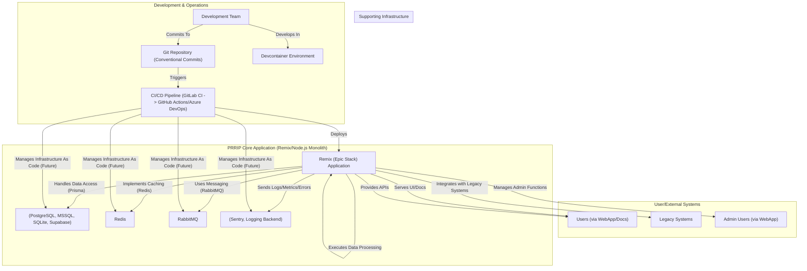

# PRRIP System Architecture

## 1. Introduction

This document outlines the architecture for the Pearl River Resort Integration Platform (PRRIP). The platform is designed as a consolidated system primarily leveraging the Remix.run (Epic Stack) framework, aiming to simplify development, deployment, and maintenance while providing robust functionality.

## 2. Architectural Goals

*   **Unified Platform:** Provide a single, cohesive platform for data integration, processing, API exposure, and user-facing applications.
*   **Developer Efficiency:** Streamline the development process with a monorepo, devcontainers, and a powerful full-stack framework.
*   **Scalability:** Ensure the system can scale to handle growing data volumes and user load, with a clear path from local development to production environments (Kubernetes, Azure).
*   **Maintainability:** Emphasize clear code structure, comprehensive documentation, and automated processes (testing, changelogs).
*   **Flexibility:** Support various data backends (PostgreSQL, MS SQL Server, SQLite, Supabase) and integrate with legacy systems.

## 3. System Overview

PRRIP will be a monorepo containing primarily a single, comprehensive Remix (Epic Stack) application. This application will house the logic for:

*   **Web Application & Documentation Site:** User interface, reporting, administration, and Markdoc-based documentation.
*   **API Layer:** Exposing data and functionality via Remix resource routes.
*   **Data Access Logic (DAL):** Using Prisma to interact with various databases.
*   **Caching Logic (CL):** Integrating with Redis.
*   **Messaging Logic (ML):** Integrating with RabbitMQ.
*   **Data Processing Logic (DPL):** Custom TypeScript/Node.js code for data transformations and algorithms.
*   **Observability Integration:** Connecting with Sentry, logging libraries, and providing interfaces for monitoring.
*   **Integration Logic:** Handling connections and data exchange with external/legacy systems.

### 3.1. High-Level Diagram

## 4. Logical Components (within the Remix Application)

While the application is a monolith in terms of deployment, it will be structured internally with clear logical components. Detailed READMEs for these will be in `docs/services/`.

*   **`app-shell`**: The Remix application itself, routing, UI components.
*   **`data-access`**: Prisma schemas, database interaction services.
*   **`caching`**: Redis client integration and caching strategies.
*   **`messaging`**: RabbitMQ client integration, message publishing/subscription logic.
*   **`data-processing`**: TypeScript modules for data transformation and algorithms.
*   **`api`**: Remix resource routes defining internal and external APIs.
*   **`integration`**: Logic for connecting to and interacting with legacy/external systems.
*   **`observability`**: Sentry setup, logging configurations, health checks.
*   **`documentation`**: Markdoc files and rendering logic.

## 5. Technology Stack Summary

*   **Framework:** Remix.run (Epic Stack) - TypeScript/Node.js
*   **ORM:** Prisma
*   **Databases:** PostgreSQL (primary), MS SQL Server, SQLite, Supabase
*   **Caching:** Redis
*   **Messaging:** RabbitMQ
*   **Monorepo Tools:** pnpm, Turborepo
*   **CI/CD:** GitLab CI (initial), GitHub Actions / Azure DevOps (future)
*   **Containerization:** Docker (for development and deployment)
*   **Deployment Target:** Local Docker, On-prem Kubernetes, Azure (future)

## 6. Data Management

*   **Primary Data Store:** PostgreSQL.
*   **Local Development:** SQLite for ease of setup.
*   **Legacy Access:** Direct connections or API integrations as needed, managed by the `integration` component.
*   **Migrations:** Handled by Prisma.

## 7. Deployment Strategy

*   **Local:** `docker-compose` to run the Remix app and all backing services (Postgres, Redis, RabbitMQ).
*   **Staging/Production (Initial):** Containerized Remix application deployed to an on-premise Kubernetes cluster. Backing services may also be containerized or use existing managed instances.
*   **Staging/Production (Future):** Migration to Azure, potentially using Azure Kubernetes Service (AKS), Azure Cache for Redis, Azure Database for PostgreSQL, Azure Service Bus.
*   **Configuration:** Environment variables will be used to manage differences between environments.

## 8. Observability Strategy

*   **Error Tracking:** Sentry (integrated via Epic Stack).
*   **Logging:** Structured logging using a Node.js library (e.g., Pino), aggregated to a central store (e.g., ELK, Azure Log Analytics).
*   **Metrics:** Key application and system metrics collected (e.g., via Prometheus client libraries or pushed to Azure Monitor).
*   **Dashboards:** Provided by Sentry, Kibana/Grafana, or Azure Monitor. Custom dashboards may be built into the Remix app for specific business metrics.
*   **Alerting:** Configured in Sentry, Grafana/Alertmanager, or Azure Monitor for critical errors or threshold breaches, with notifications to email and Microsoft Teams.

## 9. CI/CD Pipeline

*   **Initial Phase (GitLab CI):**
    *   Linting and static analysis.
    *   Unit and integration tests.
    *   Building Docker container for the Remix application.
    *   Pushing container to a registry.
    *   Deployment to Kubernetes (manual or scripted triggers).
    *   Automated changelog generation.
*   **Future Phase (GitHub Actions / Azure DevOps):**
    *   Enhanced automation for deployments to Azure.
    *   Infrastructure as Code (IaC) management (e.g., Bicep, Terraform).
    *   More sophisticated release strategies (blue/green, canary).

See [`docs/cicd/README.md`](../cicd/README.md) for more details.